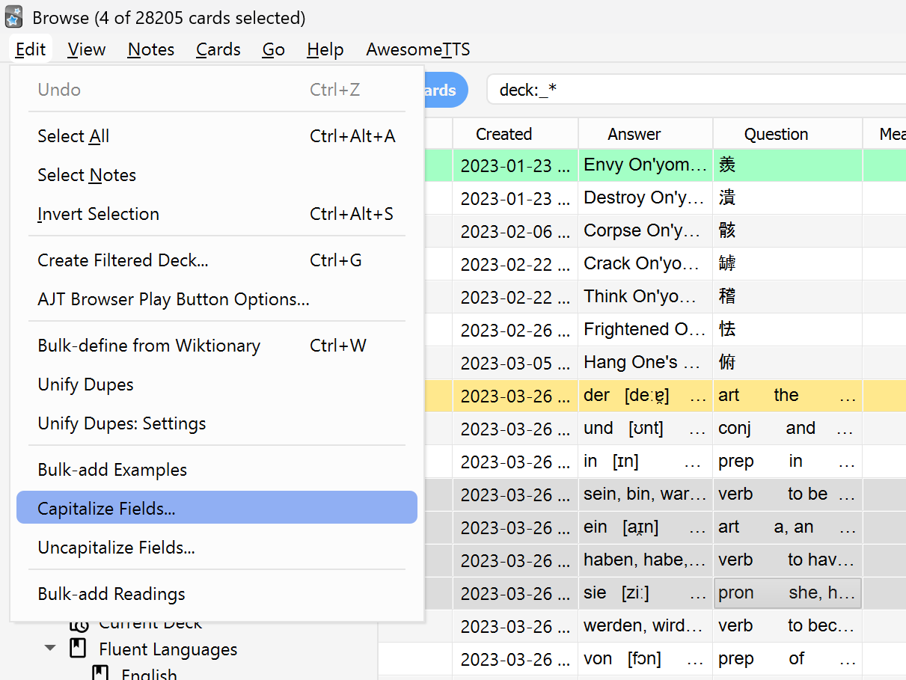
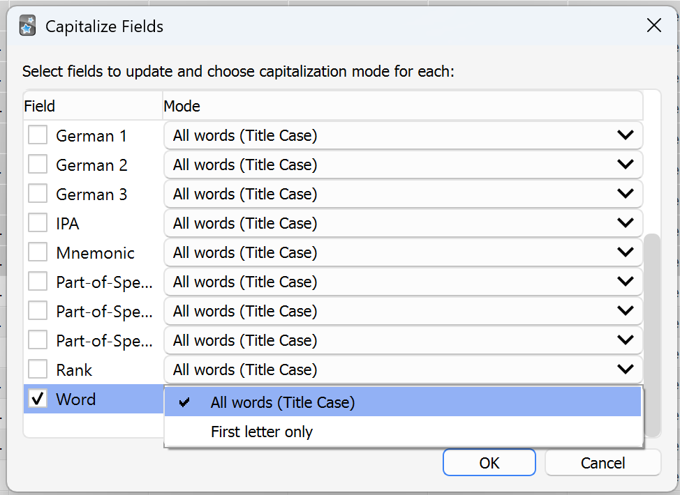

This add-on enhances Anki's Browser by allowing you to bulk-capitalize or uncapitalize text in note fields with ease. For each of the two functionalities (capitalizing and uncapitalizing), there's two options, namely capitalizing every word in a field or just the first letter overall.

**Installation**
- **Option 1**: Place the add-on folder into your Anki `addons21` directory, then restart Anki to load the add-on. (this is the only viable option until I load it to Anki). The aforementioned directory can be found under `Roaming`, which again can be easily found by typing `%appdata%` in the Windows search bar, and then under `Anki2`, so the final path would look like `C:\Users\user\AppData\Roaming\Anki2\addons21`.
- **Option 2**: Download it from anki at the following link: _yet to do_.

**Usage**
- **Open Browser**: Anki → Browse.
- **Select Notes**: Select one or more notes in the Browser list.
- **Run Command**: In the Browser window open the Edit menu and choose Capitalize Fields....
- **Dialog**: Check the fields you want to change and select a mode for each, then click OK.

**Example Usage**  

- **Browser Options**: The **Capitalize Fields...** option in the Browser's Edit menu.  
    

- **Field Selection Dialog**: The window where you select fields and capitalization modes.  
    
